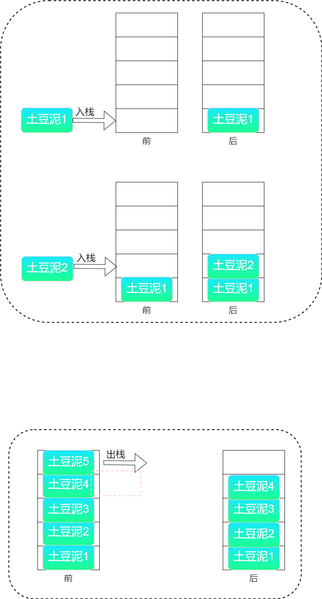
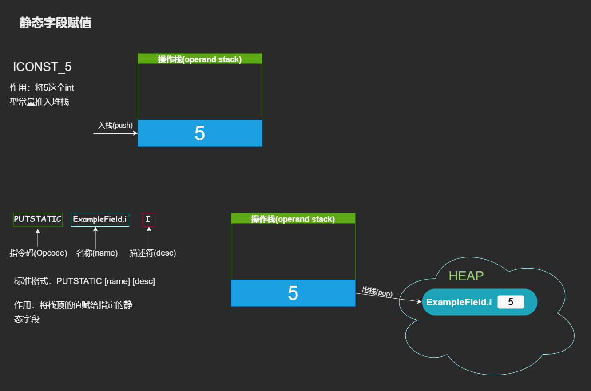
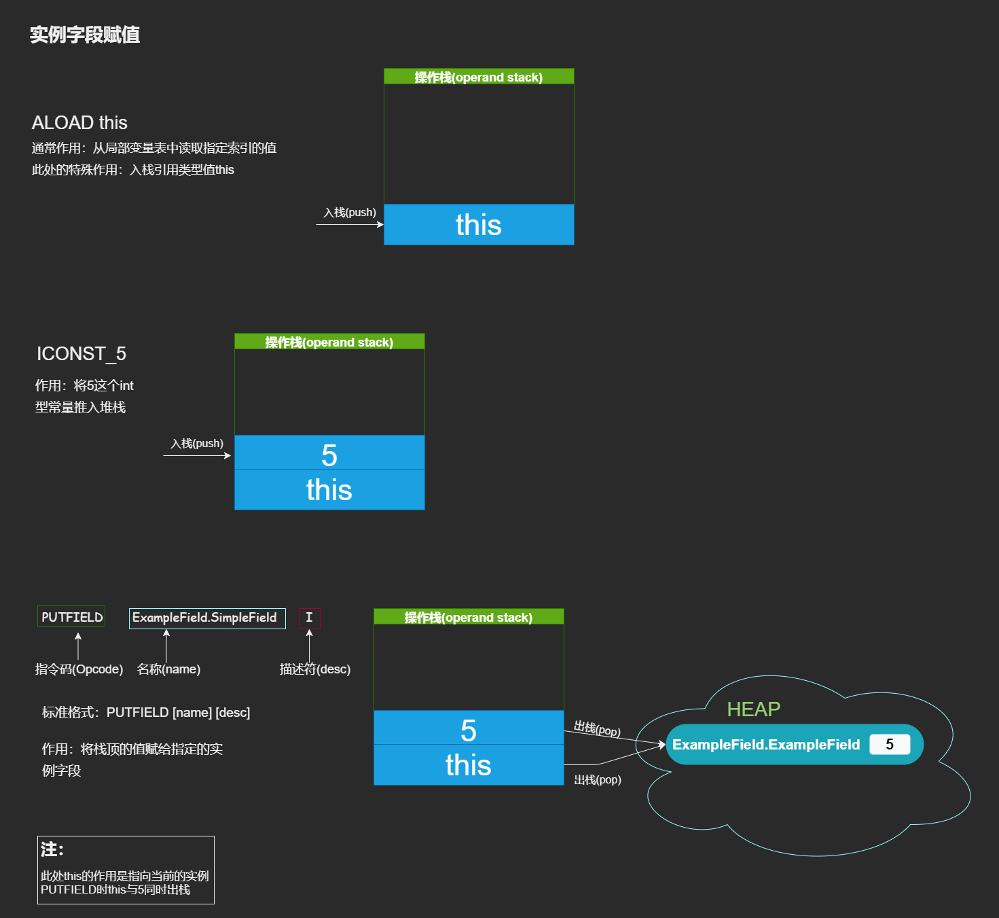

# 第三章--Java Bytecode基本概念（上）

## TLDR

我们的Java逆向工程教程将会先从简单的由ASM库简化过的Java Bytecode入手。

Java Bytecode基础概念当然要先从“Bytecode如何实现Java的基础语句”中学

<br/>
## 一、认识数据结构-栈

上一章我们知道了JVM的结构是栈，那么我们来简单了解一下栈这个数据结构。



栈口诀：先进后出

如图，栈就好像一个用来装土豆泥的木桶，先倒入（入栈）的土豆泥被后倒入（入栈）的压在下面，取（出栈）土豆泥时自然是从最上面往下取
<br/>

## 二、方法结构：
!!! note "下载ExampleVariable.class"
    [ExampleVariable.class](examples/ExampleVariable.class)

使用Recaf打开ExampleVariable.class


<br/>
### 特殊方法：

#### 1.`<init>`方法：

- `<init>`方法 的执行时期: **对象初始化阶段**

- 实例化一个类的四种途径:

1. 调用 `new` 操作符		
2. 调用 `Class` 或 `java.lang.reflect.Constructor` 对象的`newInstance()`方法
   3. 调用任何现有对象的`clone()`方法
4. 通过 `java.io.ObjectInputStream` 类的 `getObject()` 方法反序列化

<br/>
#### 2.`<cinit>`方法:

- **<cinit>方法** 的执行时期: **`类初始化阶段`**（在被jvm加载时执行，即在对象初始化阶段前）
- 作用：该方法负责为**静态成员变量/字段**赋予初始值

想具体了解参见：https://www.jianshu.com/p/8a14ed0ed1e9

<br/>打开main方法：

```java
DEFINE PUBLIC STATIC main([Ljava/lang/String; 0)V
//方法定义基本格式：DEFINE+访问权限+方法名+描述符
//此处访问权限：PUBLIC STATIC
//方法名：main
//描述符：([Ljava/lang/String;0) 描述符括号内的即为方法的参数，按照从左到右顺序排列
//  	括号内[Ljava/lang/String;代表String类型的数组
//            0代表这个参数位于局部变量表的0号元素
//       括号后的V表示这个方法返回Void
A://这是标签，用于java bytecode跳转，之后会讲。在本示例中可以无视，因为没有使用到跳转的指令码
ICONST_5
ISTORE 1
RETURN
B:
C:
```

<br/>

## 三、变量（Variables）：

### 1.局部变量：

局部变量的类型有：

- boolean
- byte
- char
- long
- short
- int
- float
- double
- reference
- returnAddress

long和double型占两个位，其他型占一个位（之前提过了）

继续用Recaf查看ExampleVariable.class中的main方法：

```java
//源代码：
public class ExampleVariable {
    public static void main(String[] args) {
        int i = 5;
    }
}
```

```assembly
//main方法的字节码:
DEFINE PUBLIC STATIC main([Ljava/lang/String; 0)V
A:
ICONST_5
ISTORE 1
RETURN
B:
C:
```

  

注：虽然字节码中有标签，但因为这里没有任何关于跳转的指令码，所以可以无视，直接按照从上到下的顺序看


RETURN指令码自然是用于Void型方法的结束

<br/>
### 2.字段Fields（成员变量Class Variables）:

字段即成员变量，在java中的概念可以自行百度

**注：HEAP堆是存放字段的地方**

<br/>
#### [1]静态字段(Static Fields)：

!!! note "下载ExampleStaticField.class"
    [ExampleStaticField.class](examples/examplesExampleStaticField.class)

使用Recaf打开ExampleStaticField.class

```java
//源代码
public class ExampleStaticField {
    public static int i = 5;
}
```

```assembly
//方法<cinit>的bytecode
DEFINE STATIC <clinit>()V
ICONST_5
PUTSTATIC ExampleField.i I
RETURN
```



<br/>
#### [2]实例字段(Fields)：

!!! note "下载ExampleField.class"
    [ExampleField.class](examples/ExampleField.class)

使用Recaf打开ExampleField.class

```java
public class ExampleField {
    public int SimpleField = 5;
}
```

```assembly
DEFINE PUBLIC <init>()V
A:
ALOAD this //这两行可以暂时忽略
INVOKESPECIAL java/lang/Object.<init>()V //忽略
ALOAD this
ICONST_5
PUTFIELD ExampleField.SimpleField I
RETURN
B:
C:
```



<br/>
#### [3]常量字段(Constant Fields)：

!!! note "下载ExampleConstantField.class"
    [ExampleConstantField.class](examples/ExampleConstantField.class)

```java
public class ExampleConstantField {
    public final int SimpleField = 5;
}
```

```assembly
DEFINE PUBLIC <init>()V
A:
ALOAD this
INVOKESPECIAL java/lang/Object.<init>()V
ALOAD this
ICONST_5
PUTFIELD ExampleConstantField.SimpleField I
RETURN
B:
C:
```

可以发现bytecode与上面的实例字段演示完全相同

不过描述符上会有一个“标签”


