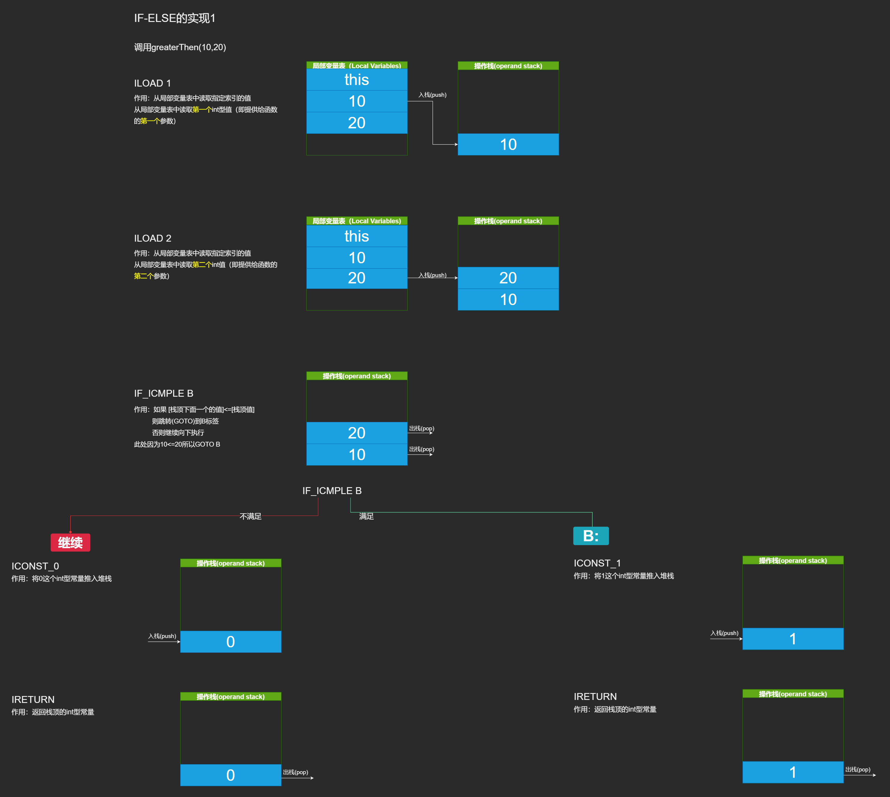
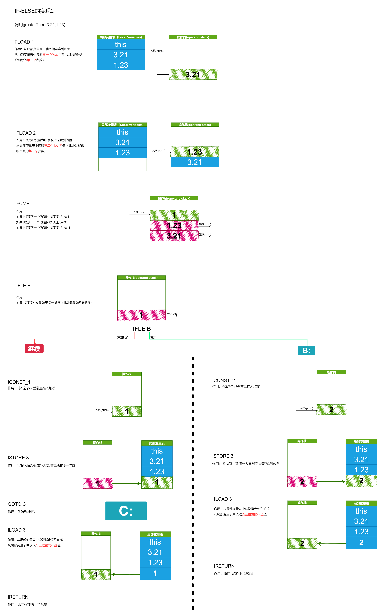

# 第四章 --Java bytecode 基本概念——条件判断


## 三、IF ELSE

包括条件控制流，例如，{==if-else==}语句和{==switch==}语句

下面就是{==if-else==}语句在bytecode中的实现


#### 示范1：

```java
public class ExampleIfElse1 {
    public int greaterThen(int intOne, int intTwo) {
        if (intOne > intTwo) {
            return 0;
        }
        return 1;
    }
}

```


```assembly
//bytecode
DEFINE PUBLIC greaterThen(I 1, I 2)I
A:
ILOAD 1
ILOAD 2
IF_ICMPLE B
ICONST_0
IRETURN
B:
ICONST_1
IRETURN
```





<br/>

#### 示范2：

```java
public int greaterThen(float floatOne, float floatTwo) {
    int result;
    if (floatOne > floatTwo) {
        result = 1;
    } else {
        result = 2;
    }
    return result;
}
```


```assembly
DEFINE PUBLIC greaterThen(F 1, F 2)I
A:
FLOAD 1
FLOAD 2
FCMPL
IFLE B
ICONST_1
ISTORE 3
GOTO C
B:
ICONST_2
ISTORE 3
C:
ILOAD 3
IRETURN
D:
E:
```




### 判断指令集合：

if_icmp<条件码> <标签>	  这组指令码用于比较栈顶与栈顶下一个的int型数值，若满足条件则跳转到指定的标签处。

| <条件码> |   含义   |
| :------: | :------: |
|    eq    |   等于   |
|    ne    |  不等于  |
|    lt    |   小于   |
|    le    | 小于等于 |
|    gt    |   大于   |
|    ge    | 大于等于 |


if_acmp<条件码> <标签>	   这组指令码用于比较栈顶和栈顶下一个的**引用型**值，若满足条件则跳转到指定的标签处。

| <条件码> |      含义      |
| :------: | :------------: |
|    eq    | 两引用型值相同 |
|    ne    | 两引用型值不同 |


ifnotnull <标签>       这个指令码用于判断栈顶的**引用型**值是否   不为NULL，若满足条件则跳转到指定的标签处。


ifnull <标签>      这个指令码用于判断栈顶的**引用型**值是否   为NULL，若满足条件则跳转到指定的标签处。


lcmp      这组指令码用于判断栈顶与栈顶下一个的long型数值，条件与操作见下面表格。

|           情况            |  操作   |
| :-----------------------: | :-----: |
| [栈顶下一个的值]>[栈顶值] | 入栈 1  |
| [栈顶下一个的值]=[栈顶值] | 入栈 0  |
| [栈顶下一个的值]<[栈顶值] | 入栈 -1 |


fcmp<条件码>       这组指令码用于比较栈顶和栈顶下一个的**float型**值，操作见下面表格。

dcmp<条件码>       这组指令码用于比较栈顶和栈顶下一个的**double型**值，操作见下面表格。

|                             情况                             |  操作   |
| :----------------------------------------------------------: | :-----: |
|                  [栈顶下一个的值]>[栈顶值]                   | 入栈 1  |
|                  [栈顶下一个的值]=[栈顶值]                   | 入栈 0  |
|                  [栈顶下一个的值]<[栈顶值]                   | 入栈 -1 |
| 栈顶或栈顶下一个的值至少有一个**不是数字（即非float/double/int/long型）** | 见下表  |

| <条件码> |                             含义                             |
| :------: | :----------------------------------------------------------: |
|    l     | 当栈顶或栈顶下一个的值至少有一个**不是数字（即非float/double/int/long型）**时，入栈-1 |
|    g     | 当栈顶或栈顶下一个的值至少有一个**不是数字（即非float/double/int/long型）**时，入栈1 |


instanceof<类名>        这个操作码判断栈顶的值是否为<类名>类的实例。若是，入栈1。若否，入栈0。


if<条件码> <标签>        这组操作码将栈顶的值与0进行比较，若满足条件则跳转到指定的标签处。

| <条件码> |   含义    |
| :------: | :-------: |
|    eq    |   等于0   |
|    ne    |  不等于0  |
|    lt    |   小于0   |
|    le    | 小于等于0 |
|    gt    |   大于0   |
|    ge    | 大于等于0 |

